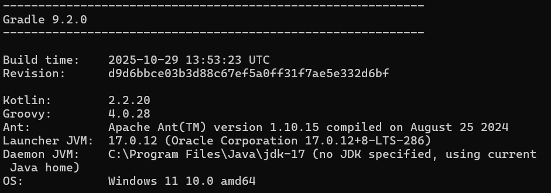

# sccpp server

## prereqs
- java 17
- ANDROID_HOME set to `C:\Users\chris\AppData\Local\Android\Sdk`



`compileSdk`/`targetSdk` = `34`

## compiling

```
.\gradlew.bat assembleDebug
```
`gradle wrapper` if .bat doesn't exit.

make sure gradle.properties contains:
```
android.useAndroidX=true
```