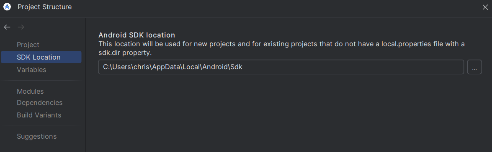
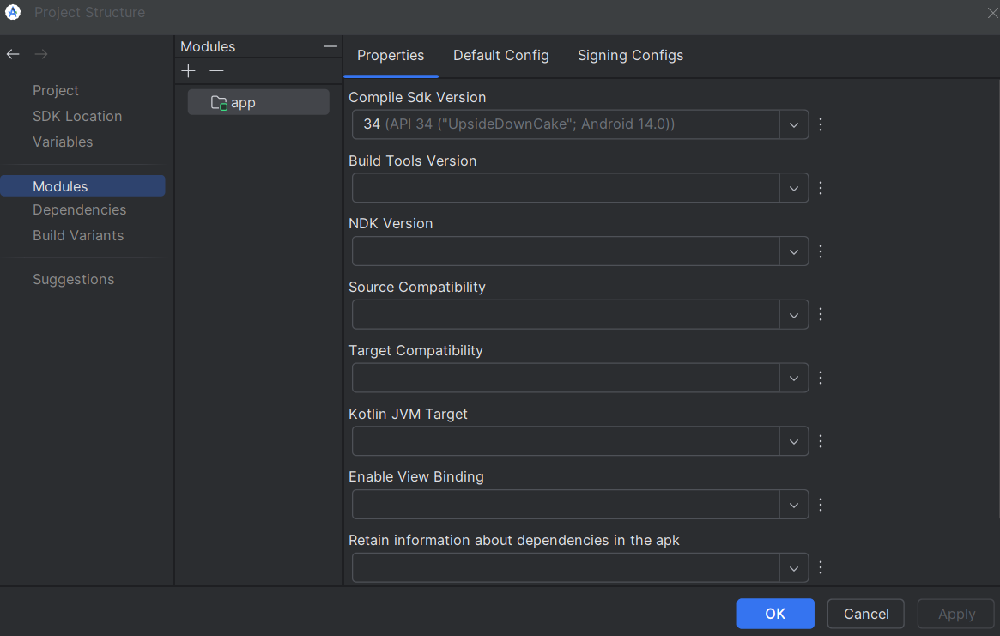

# sccpp server

## prereqs
- java 17
- ANDROID_HOME set to `C:\Users\chris\AppData\Local\Android\Sdk`


`compileSdk`/`targetSdk` = `34`

Android Studio is friendlier than VSCode for this:




## compiling

```
.\gradlew.bat assembleDebug
```
`gradle wrapper` if .bat doesn't exit.

make sure gradle.properties contains:
```
android.useAndroidX=true
```
and that build.gradle has this at the end:
```
configurations.implementation {
exclude group: 'org.jetbrains.kotlin', module: 'kotlin-stdlib-jdk8'
}
```

## pushing to device
after `.\gradlew.bat assembleDebug`, connect device and run:

```
adb install app/build/outputs/apk/debug/app-debug.apk
```

```
adb shell am start-foreground-service com.cz.sccppserver/.MainActivity
```

(early dev this would have been:)
```
adb shell am start-foreground-service com.cz.sccppserver/.ServerService
```

verify by running `logcat`, to which you should see:
```
> adb logcat -s SccppServerService 
--------- beginning of main
11-09 21:37:12.427 20034 20049 I SccppServerService: server listening on localabstract:sccpp
```

on the client side, run:
```
sccpp> ./build/sccpp.exe
```

to clean up running services:
```
adb shell am stopservice com.cz.sccppserver/.ServerService
```
or

```
adb shell dumpsys activity services | Select-String "sccpp"
```

## running

Ran one time to allow screen capture:
```
adb shell appops set com.cz.sccppserver PROJECT_MEDIA allow
```

```
adb shell am start -n com.cz.sccppserver/.MainActivity
```
Will show a dialog on device:
> "You're currently sharing with an app"